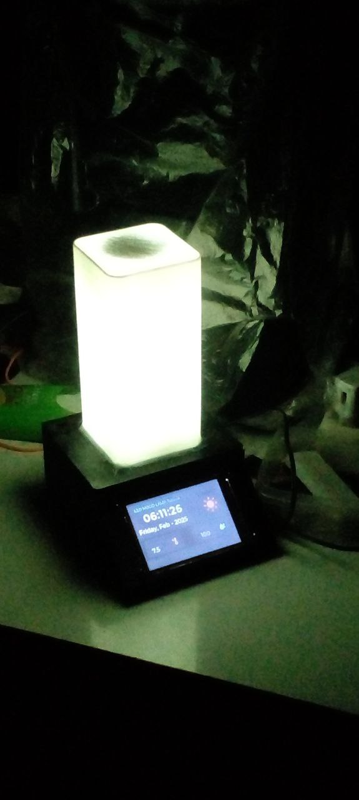

# LED Mood Lamp 
Designed and built a smart LED mood lamp using an ESP32 microcontroller.

- Controlled via a Bluetooth mobile app for selecting colors and lighting modes.

- Integrated an RTC module to display time on a TFT LCD screen.

- Synchronized time-based lighting effects using an addressable LED strip.

- Implemented smooth animations, and user-friendly interface.

